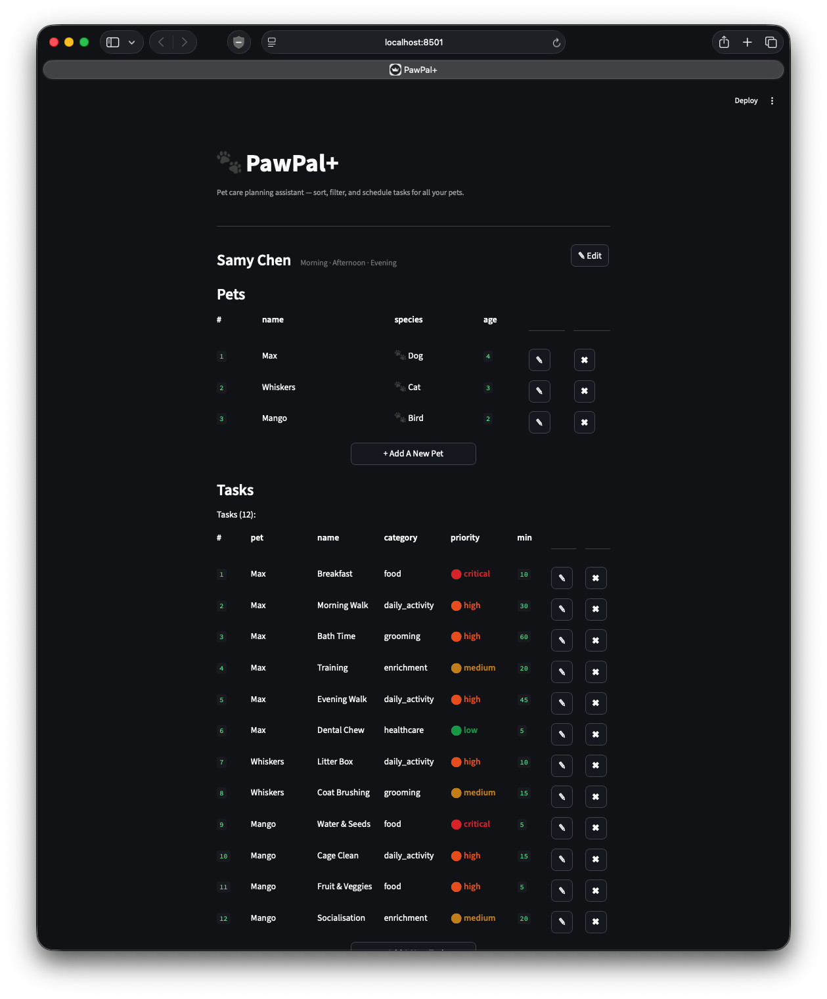
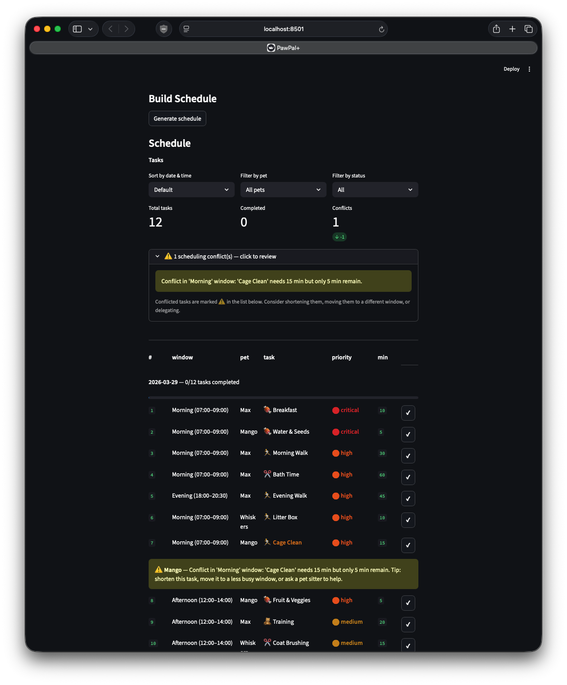

# PawPal+

**PawPal+** is a Streamlit app that helps pet owners plan and track daily care tasks across multiple pets. It applies several scheduling algorithms automatically to produce a conflict-aware, priority-ordered daily plan.

---

## 📸 Demo

**Pet & task management** — add multiple pets and assign prioritised care tasks across categories.

<a href="./course_images/ai110/demo-1.png" target="_blank"></a>

**Generated schedule** — priority-ordered daily plan with conflict detection, sort, and filter controls.

<a href="./course_images/ai110/demo-2.png" target="_blank"></a>

---

## Features

### 1. Priority-Based Scheduling

Tasks are ranked `CRITICAL > HIGH > MEDIUM > LOW`. When the scheduler generates a plan, it sorts all tasks by `(due_date, descending priority)` so critical care — medications, meals — always appears before lower-stakes activities. Within a shared time window, higher-priority tasks claim time slots first.

### 2. Conflict Detection

`Scheduler.detect_conflicts` groups tasks by their preferred time window, then greedily assigns start times in priority order using a cursor that advances by each task's duration. If a task would overflow the window's end time, it is flagged as a conflict. Flagged tasks appear with an `⚠️` warning indicator in the UI and in a collapsible conflict panel at the top of the schedule view.

### 3. Window-Aware Greedy Placement

`Scheduler._fit_into_windows` assigns concrete start and end times to tasks. Each time window maintains a cursor (the current fill position in minutes). For every task, the algorithm tries the preferred window first; if it is full, it falls back to the next available window in order. This keeps the schedule tight and prevents gaps.

### 4. Actionable Suggestions

Tasks that cannot fit in any available window trigger `Scheduler._suggest_actions`, which applies a decision rule based on priority:

- **CRITICAL / HIGH** → recommend delegation to a pet sitter (skipping has welfare consequences).
- **MEDIUM / LOW** → recommend postponement to tomorrow (one-day delay is acceptable).

Suggestions are displayed in a collapsible panel below the conflict warnings.

### 5. Recurring Task Automation

Marking a task complete automatically creates a new pending instance with the correct next due date:

- **Daily** → due date + 1 day
- **Weekly** → due date + 7 days
- **Monthly** → due date + 30 days
- **Once** → no recurrence; task is simply marked done

The spawned task inherits all properties (name, category, priority, duration, window) but receives a new unique ID, so recurring care never needs to be re-entered manually.

### 6. Sorting by Time Window

The generated schedule can be re-sorted via the **Sort by date & time** dropdown:

- **Ascending** — `Scheduler.sort_by_time` orders tasks by `preferred_window.start_time` (earliest first). Tasks with no preferred window are placed at the end, sorted among themselves by descending priority.
- **Descending** — the same list reversed.
- **Default** — original priority/date ordering from schedule generation.

### 7. Filtering by Pet and Status

`Scheduler.filter_tasks` filters the displayed task list by:

- **Pet** — shows only tasks belonging to a selected pet.
- **Status** — shows All, Incomplete, or Completed tasks.

Filters compose: selecting a pet and "Incomplete" shows only that pet's remaining tasks.

### 8. Multi-Pet Support

All pets owned by a user are scheduled together in a single plan. Tasks from different pets are merged and priority-ranked globally, so a CRITICAL task from one pet always precedes a HIGH task from another. Each task row in the schedule displays which pet it belongs to.

### 9. Full CRUD for Pets and Tasks

- **Add** a pet (name, species, age) or task (name, category, priority, duration, frequency, time window).
- **Edit** any field inline — changes invalidate the current schedule so it can be regenerated.
- **Delete** a pet (removes all its tasks) or an individual task, with a confirmation step to prevent accidents.
- Duplicate pet names and duplicate task names per pet are rejected with a validation error.

### 10. JSON Persistence

`DataStore` persists the full owner state — pets, tasks, available windows, and completion flags — to a local `data.json` file. Schedules are stored separately under a `owner_id + date` key so plans for different dates never overwrite each other. The app auto-loads the saved owner on startup so state survives page refreshes and restarts.

---

## Getting Started

### Setup

```bash
python -m venv .venv
source .venv/bin/activate   # Windows: .venv\Scripts\activate
pip install -r requirements.txt
```

### Run the app

```bash
streamlit run app.py
```

### First launch

1. Enter your name and select which time windows are available to you (Early Morning through Night). All windows are selected by default.
2. Add one or more pets.
3. Add tasks for each pet, choosing a category, priority, duration, recurrence frequency, and preferred time window.
4. Click **Generate schedule** to produce a priority-ordered, conflict-checked daily plan.
5. Mark tasks **Done** as you complete them. Recurring tasks reappear automatically with the next due date.

---

## Time Windows

| Window         | Hours         |
| -------------- | ------------- |
| Early Morning  | 05:00 – 07:00 |
| Morning        | 07:00 – 09:00 |
| Mid-Morning    | 09:00 – 11:00 |
| Afternoon      | 12:00 – 14:00 |
| Late Afternoon | 15:00 – 17:00 |
| Evening        | 18:00 – 20:30 |
| Night          | 21:00 – 23:00 |

---

## Testing PawPal+

The test suite lives in the `tests/` directory and is organized into three focused files covering 131 tests in total.

| File             | Tests | What it covers                                                    |
| ---------------- | ----- | ----------------------------------------------------------------- |
| `test_pawpal.py` | 74    | Unit tests for every class and scheduler method                   |
| `test_e2e.py`    | 40    | Full lifecycle scenarios (create → schedule → complete → persist) |
| `test_ui.py`     | 17    | Streamlit UI integration tests using `AppTest`                    |

### Running the tests

```bash
# Run all tests
python -m pytest tests/ -v

# Run a single file
python -m pytest tests/test_pawpal.py -v

# Run a specific class
python -m pytest tests/test_pawpal.py::TestConflictDetection -v
```

### What the test suite covers

#### Data models (`TestModels`)

- `Task`, `Pet`, `Owner`, `TimeWindow`, and `ScheduledTask` construct correctly with the right defaults.
- Task IDs are unique across every `add_task` call.

#### CRUD — Pet task management (`TestPetTaskCRUD`, `TestCRUDErrorCases`)

- `add_task` appends to the pet and returns the new task.
- `edit_task` updates one or multiple fields by ID.
- `delete_task` removes the task; calling it with a non-existent ID raises `ValueError`.
- Editing or deleting a non-existent task/pet ID always raises `ValueError`.

#### CRUD — Owner pet management (`TestOwnerPetCRUD`)

- `add_pet`, `edit_pet`, and `delete_pet` mirror the task CRUD contract.
- Deleting a pet removes all of its tasks from `get_all_tasks()`.

#### Schedule generation (`TestScheduler`, `TestSchedulerDegenerate`, `TestSchedulerPriorityMultiPet`)

- `generate()` returns all pending tasks assigned to `due_date = target_date` when none is set.
- CRITICAL-priority tasks appear before lower-priority tasks in the output.
- Schedules work correctly with zero pets, zero tasks, and zero available time windows.
- Tasks from multiple pets are merged and priority-ranked globally.
- A CRITICAL task from one pet always precedes a HIGH task from another.

#### Sorting correctness (`TestSortingCorrectness`)

- `sort_by_time()` returns tasks in ascending `preferred_window.start_time` order.
- Tasks with no preferred window are placed after all windowed tasks.
- Same-start-time ties are broken by descending priority.
- No-window tasks among themselves are sorted HIGH → MEDIUM → LOW.
- `generate()` output sorts by `(due_date, priority)` end-to-end.

#### Conflict detection (`TestConflictDetection`)

- Tasks that fit within their window together produce no warnings and an empty `conflicted_task_ids`.
- When combined durations overflow the window, the lower-priority task is flagged — not the higher-priority one.
- A task that exactly fills the window (boundary) is **not** flagged (uses `<=` check).
- A task that overflows by exactly 1 minute **is** flagged with a warning message.
- Warning messages reference both the task name and the window label.
- Tasks in different windows are evaluated independently — no cross-window conflicts.
- `generate()` surfaces `conflicted_task_ids` and `warnings` on the returned `Schedule`.

#### Recurrence logic (`TestRecurringTasks`)

- A DAILY task: completing it appends a new pending copy with `due_date = original + 1 day`.
- A WEEKLY task: next copy has `due_date = original + 7 days`.
- A MONTHLY task: next copy has `due_date = original + 30 days`.
- A ONCE task: no recurrence is created.
- When `due_date` is `None`, `date.today()` is used as the recurrence base.
- The spawned task inherits name, category, priority, duration, and frequency but gets a new ID.
- Completing a task twice in a chain produces correctly spaced due dates (+1 day, +2 days, …).
- A double-completion on the same task ID creates two separate recurring instances.

#### Window boundary and overflow (`TestSchedulerWindowEdgeCases`)

- A task whose duration exactly equals the window fits without conflict.
- When a preferred window is full, the task still appears in `result.tasks`.
- Tasks longer than any window still appear in the schedule (duration is never a filter).
- A preferred window label that matches no available window is handled gracefully.

#### JSON persistence (`TestDataStore`, `TestDataStoreEdgeCases`)

- `save_owner` / `load_owner` round-trips preserve ID, name, pets, tasks, and time windows.
- Tasks with `preferred_window=None` serialize and deserialize without error.
- `save_schedule` / `load_schedule` round-trips preserve ID, date, and task list.
- Schedules for different dates are stored under separate keys and never overwrite each other.
- Loading a non-existent owner or schedule returns `None`.
- Saving an owner a second time overwrites the previous version.
- An owner with no pets serializes and reloads correctly.

#### End-to-end lifecycle (`TestE2ESetup`, `TestE2ESchedule`, `TestE2ETaskCompletion`, `TestE2EEdits`, `TestE2EDeletion`, `TestE2EPersistence`)

- Full create-schedule-complete-persist cycle using a realistic two-pet, six-task, three-window scenario.
- Completing tasks (daily, weekly, once) and verifying recurrence within a live owner state.
- Editing pet names, ages, task durations, and priorities mid-lifecycle.
- Deleting tasks and pets and verifying the schedule updates correctly.
- Full persistence round-trip: owner with two pets and six tasks saves and reloads intact, including the `completed` flag.

#### Streamlit UI integration (`TestAddPet`, `TestAddTask`, `TestScheduleGeneration`)

- Adding a pet via the form populates `st.session_state.owner.pets`.
- Empty pet/task names show a validation error; the count does not change.
- Duplicate pet or task names show an error and are rejected.
- Generating a schedule without pets or tasks shows the correct error message.
- After generation, the sort, pet-filter, and status-filter dropdowns are all present.
- Filtering by pet via `Scheduler.filter_tasks` returns only that pet's tasks.

---

### Confidence level

**4 / 5 stars**

The core scheduling logic — priority ordering, conflict detection, recurrence, sorting, CRUD, and JSON persistence — is comprehensively covered with unit, edge-case, and end-to-end tests, all 131 passing. One star is withheld because the `MONTHLY` recurrence uses a fixed 30-day delta (not a true calendar month), the double-completion behavior is documented but not guarded, and UI test coverage is limited to form validation and dropdown presence rather than full schedule interaction flows.

---

## Project Structure

```
app.py              — Streamlit UI
pawpal_system.py    — Domain model, Scheduler, DataStore
main.py             — Demo data loader
tests/
  test_pawpal.py    — Unit tests
  test_e2e.py       — End-to-end lifecycle tests
  test_ui.py        — UI integration tests
data.json           — Auto-generated persistence file (gitignored)
```
